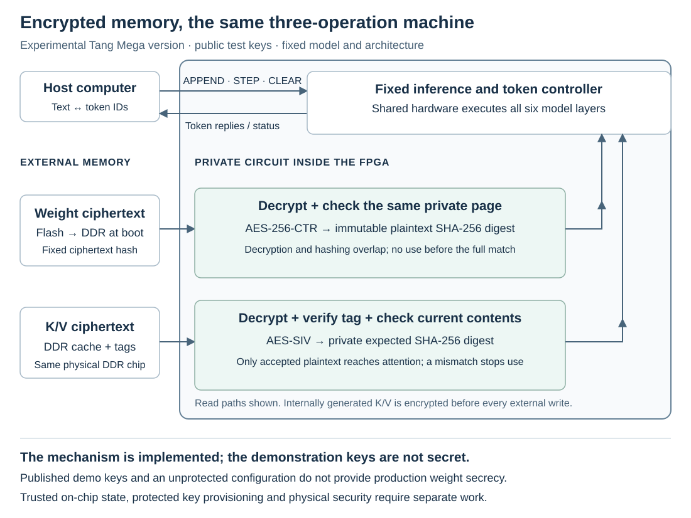

# Encrypted external memory: a third experimental version

`encrypted-memory` runs the same fixed SimpleStories-V2-5M approximation,
greedy decoding and three commands as the baseline and K/V-protected configurations.
It adds encryption for weights in external flash/DDR and for the external
attention cache (K/V). It retains before-use integrity checks and the model's
2,048-input-position limit. The inference clock is still 25 MHz.

The plaintext-memory versions check that the circuit uses allowed weights, but do
not hide external-memory contents. This version explores keeping weights
and intermediate cache contents confidential in external memory; a production
implementation would also need protected secret-key provisioning. The fixed-model
restriction still comes from the controller and immutable integrity checks,
not encryption. Published demonstration keys make this experiment reproducible
and recoverable without irreversible key programming.

**The supplied keys are public demonstration values, also embedded in the
RTL and FPGA configuration. This package does not keep its model or K/V
secret from someone who has those keys.** It demonstrates the implemented
encrypted-memory data path; it is not a production secret-provisioning scheme
or evidence of resistance to invasive attacks or side-channel analysis.
No irreversible key, OTP, fuse or security-lock programming is required.

## What changes, and what does not

| Configuration | External weights | External K/V | Before-use K/V integrity |
| --- | --- | --- | --- |
| Baseline | Plaintext; fixed-model digest check | Plaintext | No content check |
| K/V-protected | Plaintext; fixed-model digest check | Plaintext | Private expected SHA-256 digests |
| Encrypted-memory | AES-256-CTR ciphertext; fixed plaintext digests remain | AES-SIV ciphertext and tags | SIV check **and** private expected SHA-256 digests |

The plaintext model asset is unchanged. This third image
requires a **different flash image**; switching to it is not an SRAM-only
configuration change. The tokenizer and underlying integer model are unchanged.



*The FPGA boundary is a circuit-ownership boundary, not a claim of physical
invulnerability. The two DDR regions share one physical memory. Keys in this
demonstration are public.*

### Weights

At startup, the circuit copies the fixed ciphertext image from flash into
DDR and verifies its full-image digest before allowing inference. During
inference, a four-bank private cache decrypts requested weight pages with
AES-256-CTR. SHA-256 checks the **same on-chip plaintext copy** against an
independent immutable digest; the arithmetic cannot use it until the full
page check succeeds. Decryption and hashing overlap, without another
whole-page buffer or an early permission to use unverified data.

The private AES circuit retains all 14 AES-256 rounds and processes them in
five round-processing clocks per block (3 + 3 + 3 + 3 + 2 rounds). This does
not include request/response overhead. The four banks share two AES engines
and two SHA-256 engines, with private arbitration and explicit ownership of
each result. These are not reduced-round encryption or host-accessible
cryptographic accelerators. All 64 SHA-256 rounds are retained.

Four projection multiplier lanes time-share groups of up to 64 fixed output
rows, with 16 rows per lane and a separate accumulator for each row. The
per-row arithmetic order is unchanged. Packed fixed-metadata ROMs and private
block-RAM queues help fit the cache and checking circuits on this FPGA. These
are internal scheduling and storage choices, not additional user operations.

The fixed model image is 7,265,984 bytes. Each plaintext page is 4,096 bytes;
the last page contains 3,776 image bytes and 320 zero-padding bytes for the
digest. Those padding bytes are not additional ciphertext bytes in flash.
Small fixed coefficient/scale metadata also remain in on-chip ROM. Thus
“encrypted weights” does not mean every model-related constant is hidden.

The ciphertext digest and plaintext page digests serve different purposes.
Even knowing the published demonstration key does not provide a supported
way to change the permitted model: changing plaintext changes the immutable
page digest. This assumes the checking circuit and its trusted state remain
intact. There is no public key-upload, model-update or cryptography command.

### Attention cache

Internally produced K/V data are sealed before external writes. A read is
decrypted into private storage, its complete SIV tag is checked, and the
existing plaintext SHA-256 guard checks it against the current privately
recorded expected contents before attention receives it. A genuine old
record can have a valid SIV tag: the separate expected-digest mechanism is
still needed to reject stale contents, including after a repeated epoch.

The fixed record format uses AES-SIV as specified in
[RFC 5297](https://www.rfc-editor.org/rfc/rfc5297). It has separate 256-bit MAC
and counter-mode keys. Each K or V role has 130 plaintext bytes: 128 coordinate
bytes plus the two shared exponent bytes. Its external record is 160 bytes:
130 ciphertext bytes, a 16-byte tag, then 14 zero-padding bytes. Three
associated-data fields bind the domain, model identity and private
`epoch/layer/head/role/position/length` descriptor. This is a fixed inference
format, not a host-accessible encryption service. Two roles occupy ten
256-bit words per head, so the encrypted K/V region is larger than the
plaintext nine-word layout.

The SHA-256 guard groups 16 positions for verification. Its final group may
read the newest stored row even when attention obtains that row from the
private pending-row buffer. That read is expected; it does not bypass the
buffer or permit an unverified attention operand.

The guard pipelines its private RAM reads while assembling words for hashing
or returning already verified data. It reads the eight 32-bit chunks of a
256-bit word in nine clocks. This overlap does not release unverified data or
remove any digest check.

## Evidence and limits

The selected image completed placement and routing. The reported inference
clock setup margin is **+0.084 ns** and hold margin **+0.144 ns** at 25 MHz.
The setup margin is very small. There are 161 setup/recovery and two
hold/removal violated endpoints within vendor DDR. A positive inference
margin does not qualify the entire design or establish that all controller
timing exceptions are correct. This remains an exploratory board image.

The current physical installation/readback/inference/restoration test checked
six generated tokens, including CLEAR/replay, against the integer reference.
The encrypted image delivered **7.68 tokens/s** on this short sequence.
These timings include first-token work;
they are not long-stream benchmarks or an isolated measurement of AES cost.
The [current measurement summary](evidence/speed-2026-10-02/board.json)
retains exact per-STEP times. Its checker recomputes the arithmetic and
checks the selected source/image association. The
[current native summary](evidence/speed-2026-10-02/native.json) records
the inference margins and remaining global violations.

The broader physical campaign passed eight cases with **522 main-case
generated tokens**, plus 12 known-answer tokens around each case. Those
before/after CLEAR sequences are counted separately from the measurements
below. Every returned token matched the fixed integer reference.

| Case | Prompt tokens | Generated tokens | First STEP (s) | Later decode (tokens/s) |
| --- | ---: | ---: | ---: | ---: |
| `around128` | 1 | 128 | 0.119 | 4.266 |
| `fox128` | 8 | 128 | 0.884 | 4.073 |
| `help64` | 7 | 64 | 0.782 | 5.230 |
| `moon64` | 9 | 64 | 1.003 | 5.142 |
| `prefix128` | 128 | 128 | 26.638 | 2.253 |
| `prefix512` | 512 | 4 | 268.551 | 1.032 |
| `prefix1024` | 1024 | 4 | 969.405 | 0.550 |
| `prefix2047` | 2047 | 2 | 3664.520 | 0.286 |

The first STEP includes prompt processing; later decode is the number of
remaining STEP replies divided by their total elapsed time, not an
average of per-token rates. Connection setup, prompt upload, CLEAR and
the surrounding known-answer checks are excluded. The long-context
cases have only one or three later replies, not long steady streams.

For comparison with the faster plaintext protected image, see
[K/V-protected measurements](KV-PROTECTION.md#measured-performance).
The two images were measured in separate campaigns.

The `prefix2047` case appended 2,047 prompt tokens and accepted two STEP
requests, evaluating model positions through 2,047. The last returned
token leaves 2,049 tokens on the tape; this is **2,048 model-input positions**,
not a 2,049-token model context. APPEND at the input limit and both
APPEND/STEP after the final output slot were rejected; CLEAR and the
following short replays passed without reloading.

These board tests used the UART test client, not the browser or the app's
qualification API. Full flash readback and restoration also passed.

The [current measurement summary](evidence/speed-2026-10-02/board.json)
retains exact timings, reference tokens and source/receipt hashes. Its
offline checker validates those associations and arithmetic; it does
not replay withheld private UART/recovery records or attest the chip.

Separate connected simulations checked six full-model cases and 18 tokens,
with genuine ciphertext boot, CLEAR/replay and corruption refusals. Those
are simulations, not measurements of the physical controller under every
reset or fault condition.
The [recorded simulation summary](evidence/encrypted-memory/current-validation.json)
binds 71 production modules to the supplied hardware sources. It also records
AES component tests and a limited key-selector proof for the byte-identical AES
primitives, plus separate K/V-guard tests with stalls, cancellation and fault
cases. These are not proofs of AES or of the encrypted machine. Its offline
checker validates file identities and summary consistency; it does not rerun
the private simulations.

The native resource report counts 65 `MULTALU27X18` and three `MULT12X12`
primitives. The design also uses DSP primitives as fixed SHA-256 adders,
with a multiplier input tied to one and controls fixed in the circuit.
These resources do not add a public multiplication operation. A primitive
count alone does not show how much reusable multiplication hardware an
attacker could obtain; the training-capacity estimates below do not cover
this encrypted configuration.

The existing [formal receipts](FORMAL-STATUS.md) and
[training-capacity estimates](TRAINING-CAPACITY.md) retain their stated
baseline/protected scope. They do not cover this encrypted
configuration, its cache or its latency. Encryption does not by itself
establish a smaller residual training factor. All versions retain the same conceptual
inference-only restriction under the frozen-configuration assumption.

For a deployed confidential design, keys and configuration would need a
protected provisioning/storage path, with debug/configuration access and
physical/side-channel threats assessed separately. Authentication also
depends on intact private state. No such resistance is certified here.

## Reproduce and inspect the package

The third variant ships its exact 96 redistributable inputs, the four pinned
vendor dependency identities, and the selected prebuilt image. No vendor
primitive simulation-library sources are bundled. The existing vendor
download/build instructions and license boundaries still apply.

From the root of a clean checkout or release archive:

The first command uses `--strict` to check all listed files and reject any
extras, including local Python environments and generated build files.
If you have already used this checkout, omit `--strict` to verify the listed
files while allowing those extras; do not delete your local files just to
run the check. See [release checks](REPRODUCE.md#release-analysis-and-helper-tests).

```sh
python3.12 -I -S -B tools/verify_release.py --strict
python3.12 -I -S -B tools/check_encrypted_memory.py
python3.12 -I -S -B tools/check_encrypted_validation.py
python3.12 -I -S -B tools/check_encrypted_board_evidence.py
python3.12 -I -S -B tools/encrypt_model_image.py --openssl /absolute/path/to/openssl
```

The final command independently reproduces every ciphertext byte with
OpenSSL and decrypts it back to the exact supplied plaintext model. It is
offline, uses only public test constants, and never accesses a board. Add
`--output /fresh/path/model.bin` to save the reproduced ciphertext; existing
files are refused. The unchanged [model reconstruction](REPRODUCE.md)
produces the plaintext starting point.

Source locations:

- `variants/encrypted-memory/hardware/`: exact build inputs, including the
  original project, ROM data and constraints.
- `host-app/hardware-inputs-encrypted-memory.json`: all 100 input hashes.
- `variants/encrypted-memory/PUBLIC-TEST-KEYS.json`: published demonstration keys and nonce.
- `prebuilt/encrypted-memory/BUILD.json`: source/image build association,
  with `timing_qualified: false`.
- `prebuilt/encrypted-memory/project/impl/pnr/shared_product.fs`: selected SRAM configuration.
- `assets/board1-encrypted-model2048.bin`: exact ciphertext flash payload.

For a local rebuild, follow [the existing vendor setup](VENDOR-SETUP.md#check-then-build)
with `--variant encrypted-memory`. The same pinned macOS GOWIN executable and
four separately obtained IP files are required. Preflight checks the exact
100 inputs; it does not run the vendor tool or access hardware. A fresh build
must be assessed on its own results, not assumed to reproduce the selected
placement or to improve the remaining timing violations.

## Install or restore

Use only the exact supported board, flash and programmer versions in
[PROGRAMMING.md](PROGRAMMING.md). Read that entire guide first, including
restoration. **These instructions erase flash.** Preserve two separately
read, equal, complete 16-MiB backups and their receipts before writing; keep
them outside the repository. Stop the app and other UART/JTAG users.
Do not proceed on any ID mismatch, tool error or protection warning.

Follow sections 1 and 2 of that guide unchanged. With its checked shell
variables, replace section 3's plaintext installation with:

```sh
"$FPGA_PROGRAMMER" --device GW5AST-138C --cable-index 4 --location "$FPGA_USB_LOCATION" --frequency 0.9MHz --operation_index 52
"$FPGA_PROGRAMMER" --device GW5AST-138C --cable-index 4 --location "$FPGA_USB_LOCATION" --frequency 0.9MHz --operation_index 56 --mcuFile "$FPGA_PACKAGE/assets/board1-encrypted-model2048.bin" --spiaddr 0x801000
```

The example cable index must be replaced if your checked scan reports a
different one. Require the exact success/target/operation checks in the
original guide, one command at a time. Then reload its read-only maintenance
image and capture a **fresh full-array read** as in section 4. Use a new
output filename and this ciphertext-specific file checker:

```sh
python3.12 -I -S -B tools/check_encrypted_flash.py --readback "$FPGA_RECOVERY/encrypted-readback.bin"
```

Require full-array hash
`779fc1a8a0158ce66e7dc52ac4662259f5618f01303d3299eb990b2f361d2ef1`.
Only `[0x801000, 0xEEEEC0)` contains the ciphertext image; all other bytes
must be `FF`. A programmer's own verification alone does not replace this
independent read. The checker verifies a file, not its physical provenance.

After a successful readback, use section 5's SRAM operation with
`--fsFile "$FPGA_PACKAGE/prebuilt/encrypted-memory/project/impl/pnr/shared_product.fs"`.
Keep power on, allow at least 60 seconds for boot, and run the host guide's
known-answer qualification with `prebuilt/encrypted-memory/BUILD.json`.
Use its explicit exploratory-timing acknowledgement. Requalify after every
power cycle/reload. The browser does not install, select or switch hardware.

The browser's current limit remains **128 prompt tokens and 128 generated
tokens**, with a 120-second command deadline. It is not a full-context test
interface. For a deliberately long prompt, the low-level token CLI accepts
`--timeout 14400` before its subcommand, allowing four hours for a command
response. This changes only the host's wait, not RTL watchdogs or the model's
context. A timeout does not prove a command was not accepted; stop and
investigate instead of blindly repeating it. The [measured table](#evidence-and-limits) reports the deliberately long
CLI cases; those checks do not extend the browser's 128-prompt-token limit.

To return to either original configuration, **restore the matching plaintext
flash image as well as its SRAM image**. Section 6 restores your own verified
full backup and independently compares every byte. If that backup predates
model installation, it restores the factory contents instead: use the
original model-install/readback workflow before loading an original
inference image. Never use another person's flash backup. Keep all recovery
files private; do not use OTP, fuse, key-lock or unrelated flash-mode options.
