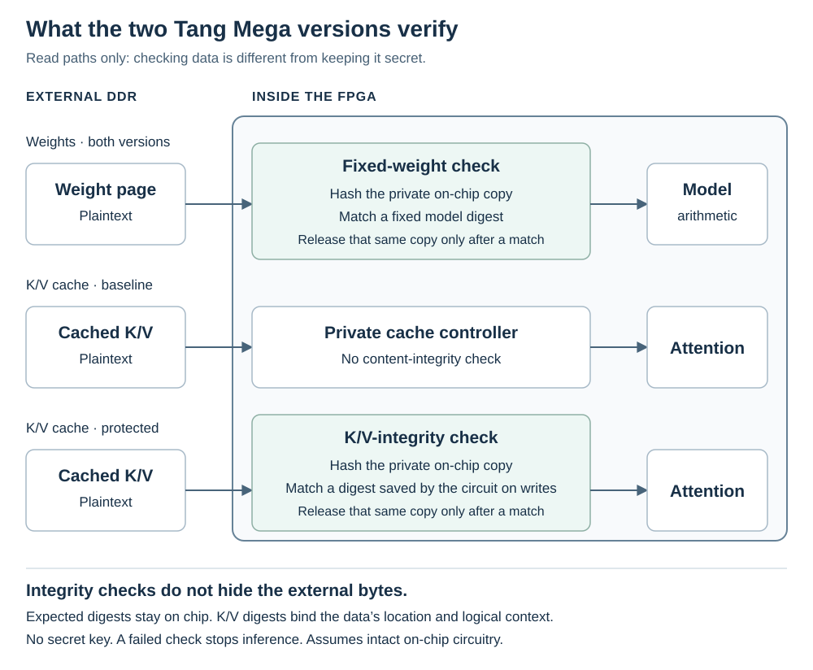

# Two versions: speed and attention-cache integrity

This comparison covers two plaintext-memory FPGA configurations. **Baseline** is
the design without K/V integrity checks. **K/V-protected** is
the integrity-checking prototype. Both run the same integer approximation of
SimpleStories-V2-5M, authenticate the same fixed model weights, and expose only
`APPEND`, `STEP` and `CLEAR`. Both support 2,048 input positions, with one final
output slot. Changing configurations is a development-board programming step,
not an operation offered by either frozen inference circuit. Both use
packed attention storage. The weight-page checker performs four SHA-256
rounds per cycle in the baseline and two in the protected configuration;
both retain all 64 rounds.
The third [encrypted-memory configuration](ENCRYPTED-MEMORY.md)
retains K/V integrity and adds encryption with public test keys.

## Why use the protected version?

For this project's anti-training requirement, memory tampering matters when
it enables practically useful training computation. Deliberately causing
incorrect answers or stopping inference does not, by itself, defeat that
requirement. Cache integrity is a means to restrict possible training uses,
not a separate requirement that every form of tampering be prevented.

The purpose is to strengthen the inference-only design against **physical
tampering with external memory**. Both versions already prevent ordinary host
software from requesting arbitrary memory or matrix operations. But that
restricted interface does not, by itself, stop someone with physical access
from changing bytes in DDR.

Cached keys and values are operands in attention's runtime matrix
multiplications. In the baseline, a physical memory/bus attacker could try
replacing those operands with chosen values and observing later cache writes.
That would not automatically provide general matrix multiplication or useful
training: the other operands, execution schedule and observable results remain
constrained. We have not demonstrated a useful training attack through this
route. Nevertheless, preventing the substitution makes the inference-only
argument stronger.

The protected version is designed to check that cached data match values the
fixed inference circuit previously stored for that location and logical
context. The formal checks trace accepted private writes and verified reads;
they do not prove that those writes are the model's correct mathematical K/V
values. Under the intact-circuit, SHA-implementation and cryptographic
assumptions described below, the design's integrity argument is that changing
DDR alone cannot supply chosen cache operands. An attacker would also have to defeat
the integrity check or its trusted state. This is an additional barrier to
repurposing the arithmetic, not a proof that all training-related misuse or
physical attacks are impossible.

Choose the baseline for faster long continuations in the measured tests, and the protected version
to demonstrate this stronger treatment of external memory. Both implement
the same model; protection does not improve its answers when memory is
unaltered. The cost is more on-chip storage and slower inference, especially
at long contexts, as the measurements below show.

The protected configuration also includes a tested private PLL startup
qualifier and its own transport/reset circuitry. It is not
just a software option in the baseline. Neither configuration has complete
vendor-DDR timing signoff.

## What K/V protection adds

*Read paths, with transport and buffering details simplified. Cache writes
come from the fixed inference circuit, not from host-supplied tensors.
The diagram assumes the on-chip circuit and its private expected digests
remain intact; it does not claim protection against arbitrary circuit editing.*

Attention keeps previously computed keys and values (K/V) in external DDR.
The baseline restricts access to this memory through private hardware
controllers, but does not authenticate its K/V contents. Software cannot
request arbitrary DDR reads or writes through the three-command interface.
A physical memory/bus attacker is a separate concern.

In the protected configuration, the controller records a SHA-256 digest in
private on-chip memory when internally generated K/V data are stored. On a
later external read, it stages the data privately, checks the digest, and
releases only the verified copy. Changing DDR after verification does not
change that sealed on-chip copy. A failed check stops inference rather than
returning the altered data to attention.

The expected digests are **not stored alongside the data in untrusted DDR**.
There is no shared secret or external command for replacing them. This is an
integrity check against private expected values, not encryption: someone
with physical access can still observe the external K/V bytes.

The design assumes that the guard, its private memories, and the rest of the
on-chip control circuit remain intact. Its integrity argument relies on a
correct SHA-256 implementation and cryptographic collision resistance, so
an attacker cannot practically substitute different data with the accepted
digest. SHA computation is independently simulation-tested, not formally
proved here. Tags need protection against writes, not secrecy. It is not protection
against arbitrary modifications to those circuits or a certified bound on
training capacity. A physical attacker can also disrupt operation; integrity
checking does not guarantee availability.

As in the [repository's assessment](README.md#in-what-sense-is-it-inference-only),
this argument assumes the protected configuration is permanently frozen.
The digital proofs do not model voltage, clock, electromagnetic or reset
glitches. Build hashes identify the recorded image; they do not attest what
a connected FPGA is running.

## Organization and freshness

The guard groups **16 token positions, one K/V head and one role**
per digest. Key groups contain words 0–3 and the shared exponent/tail word 8;
value groups contain words 4–7 and word 8. This follows the existing attention
access pattern so fewer irrelevant bytes are fetched and hashed.

The hash covers a domain identifier, epoch (the CLEAR counter), layer, position group,
head, role, valid-position count and fixed geometry, as well as the data.
There are 3,072 full 256-bit expected digests, using 96 KiB of private tag
storage. The guard's other private buffers also consume on-chip memory.

Partial groups are built from internally produced data, not by trusting a
reread of old DDR bytes. The final write is acknowledged only after the
associated tags are committed. The existing K/V controller retains its
atomic row-commit rules and internally owned pending-row path.

Freshness depends on the on-chip committed prefix and expected tags, not on
the epoch counter alone. Reads must lie below the prefix; appends replace
all affected tags before making new positions readable; reset and CLEAR
zero the prefix. The epoch increments on a CLEAR edge, but resets to zero
on reset. It is not a persistent counter across power cycles. Old memory
contents therefore remain unauthorized until the relevant positions have
been populated by the circuit again.

`CLEAR` revokes prior prefix, cache and response ownership. An already-issued
transfer must drain before new work starts; old completions cannot populate
the new logical context. Detected integrity faults remain terminal across
`CLEAR`. This is logical invalidation, not physical zeroing or confidential
erasure. Replaying identical bytes after they have legitimately been
repopulated is indistinguishable from the correct data and does not change
the computation.

## Measured performance

These are **workload-specific FPGA trials**, not performance guarantees. The table
compares the same workloads, but the baseline and current protected image
were measured in separate campaigns. Rates divide the number of replies
after the first by the sum of their STEP durations. They include host/UART
reply overhead, but not gaps between commands. Prompt length describes the
start of the run; context grows with generation.

| Prompt / generated tokens | Baseline cached tokens/s | Protected cached tokens/s | Baseline first STEP | Protected first STEP |
| --- | ---: | ---: | ---: | ---: |
| 1 / 128 | 8.766 | 5.231 | 0.068 s | 0.102 s |
| 128 / 128 | 5.354 | 2.695 | 12.359 s | 21.742 s |
| 512 / 4 | 2.675 | 1.209 | 106.074 s | 226.139 s |
| 2,047 / 2 (one cached STEP) | 0.795 | 0.334 | 1,329.104 s | 2,842.045 s |
| 2,048 / 1 (no cached STEP) | — | — | 1,330.345 s | 3,131.615 s |

Repeating the 1/128 trial gave **8.766 baseline** and **5.221 protected tokens/s**.
The protected version's first six steps reached **9.83 tokens/s**.
That is a short-context result, not a sustained rate for long stories;
the full 128-output continuation averages **5.22–5.23 cached tokens/s**.

The weight-page SHA-256 engine performs four rounds per cycle in the baseline
and two in the protected version. Both retain all 64 SHA-256 rounds and pack
eight attention-value coordinates into each 128-bit row. Both overlap up to
eight private projection-weight reads. The baseline additionally prefetches
the next 512-bit hash block while the current block is being checked.
These are private implementation choices, not additional user commands or
approximations to the numerical model. The protected version also has a
separate K/V hash engine.

Short STEP times cluster near multiples of an approximately 17 ms host
reply-delivery interval. Small compute changes can appear as a one-interval
jump or no change. The underlying cause is not established. These host timings
are not precise measurements of compute-only speed. See
[the host-timing record](evidence/leaf-speed/host-timing.json).

Both images passed full-window, boundary-rejection and CLEAR/replay tests,
including separate 2,047- and 2,048-token prompts. Their capacity is 2,048
model-input positions plus one final output slot. The two full-window rows
are boundary checks, not sustained-generation benchmarks. In particular,
the protected 2,048-token prompt took about 52 minutes to evaluate.

The [current baseline and protected measurements](evidence/read-window/board.json)
retain unrounded times, exact reference tokens and original record hashes.
They are curated summaries of audited private logs, not bundled raw-log replays.
At longer contexts, attention rereads more cache data, so K/V protection's
cost grows with context length.

| Full-product resource | Baseline | Protected |
| --- | ---: | ---: |
| Logic elements | 86,667 | 87,905 |
| Registers | 46,925 | 52,068 |
| Occupied CLS | 58,233 | 59,946 |
| BSRAM blocks, out of 340 | 196 | 278 |
| DSP blocks, vendor accounting | 74.5 | 74.5 |

These are whole-product implementation differences, including transport/reset
changes and physical packing; they do not isolate the hash engine's cost.
Both inference clocks remain 25 MHz. See the
[current native summaries](evidence/read-window/native.json).

## Evidence and limits

- The baseline's public full-model replay runs four cases: ordinary and
  stalled inference with ten exact STEP results in total, and two
  corrupted-weight rejections. Protected guard simulations and controller
  proofs have the separate scopes below; they are not full-model proofs.
- A [portable guard replay](simulation/kv-protected/README.md) runs the exact
  shipped guard, hash wrapper and SHA circuit against independent model-derived
  data. It exercises corruption, wrong-location/stale data, sealed reads and
  CLEAR. A separate full-geometry run populates all 2,048 positions in all six
  layers through ordinary writes. This is component simulation, not a theorem.
- **The current image passed six physical trials totaling 391 main-case
  outputs**, plus 72 CLEAR/replay outputs. These include a repeated 128-output
  continuation and both full-context boundary cases. **Deliberately corrupted DDR was tested in simulation**, not by
  physically modifying the board's memory or bus. Do not describe the latter
  as a demonstrated physical attack-rejection test.
- [Source-bound formal checks](formal/kv-integrity/README.md) prove
  guard/hash-framing history, its connection to the atomic cache through
  selected real parent gates, and a separate attention capture/use theorem.
  Both solvers complete each result. SHA compression and parts of the
  surrounding computation are abstracted; this is not a whole-machine or
  cryptographic-security theorem. The baseline token-shell and connected
  proofs were also replayed against the supplied sources. See
  [all formal scopes](FORMAL-STATUS.md).
- The baseline report has 145 setup/recovery and ten hold/removal violated endpoints;
  the selected protected report has 152 and ten, within the vendor DDR hierarchy.
  The complete reported-endpoint census finds no negative path with an end
  outside vendor DDR. This census comes from private vendor reports; the
  public native summary includes report hashes, not the full reports.
  The baseline inference-clock setup/hold slacks are +0.018/+0.144 ns, leaving
  very little reported setup margin. The protected inference-clock
  setup/hold margins are +0.228/+0.116 ns. Seven DLL
  hold violations of −0.010 to −0.075 ns and other DDR/reset paths remain
  unresolved. No timing exception or waiver is applied. The custom-logic screen,
  correct outputs and different violation counts do not establish complete
  timing signoff. Vendor hard-block/startup contracts and board I/O timing
  information are still needed. The startup qualifier does not waive them.

## Run or rebuild

The two prebuilt images are:

- Baseline: `prebuilt/inference/project/impl/pnr/shared_product.fs`.
- Protected: `prebuilt/kv-protected/project/impl/pnr/shared_product.fs`.

Use the matching `BUILD.json` in the same prebuilt directory. Follow
[PROGRAMMING.md](PROGRAMMING.md) to load one image into SRAM, then perform
the [local known-answer check](host-app/README.md). Switching variants does
not require reinstalling the unchanged model in flash. A successful short
check is not independent attestation of the FPGA's configuration.

The protected custom project is in `variants/kv-protected/hardware/`. For an
optional source build, add `--variant kv-protected` to the existing
[build command](VENDOR-SETUP.md#check-then-build). Both variants use the same
four separately acquired Gowin source-IP dependencies and tool installation.
Both supplied images have been tested on the board. A recipient-side source
build produces its own route and requires its own validation.
