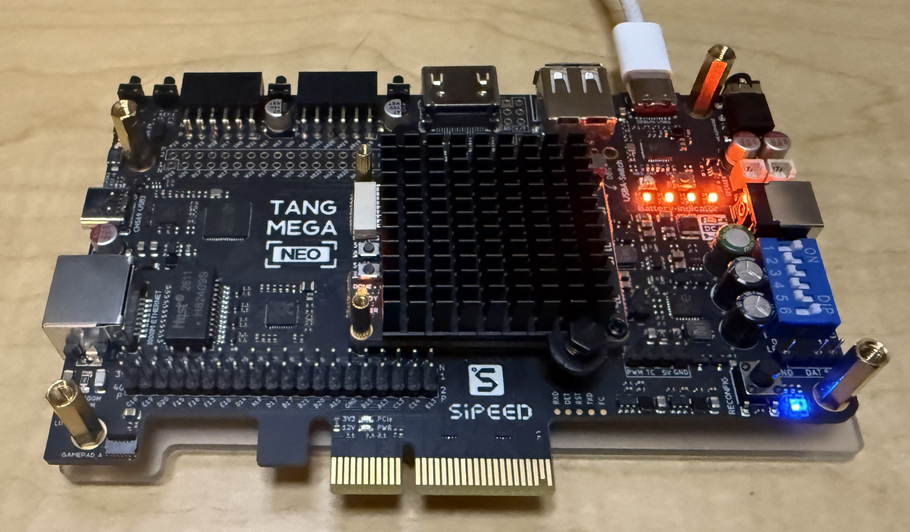
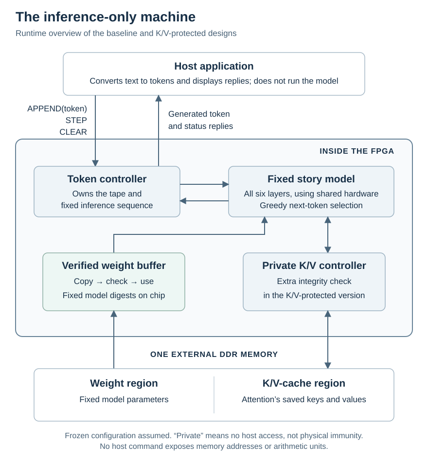

# An inference-only machine: an FPGA proof of concept

The paper *The Feasibility of a Hardwired Pause of Frontier AI Training*
([hardwired-pause.ai](https://hardwired-pause.ai))
introduces the idea of **inference-only chips** in both an idealized sense
and a practical, operational sense. The idealized machine permits only
fixed-model inference through three user operations. The practical standard
allows limited residual training capacity, but requires a verifiable bound
that remains meaningful even against an adversary with physical possession
of the hardware.

**This repository provides a working conceptual demonstration using a physical
FPGA.** A fixed 5.35-million-parameter story model runs behind a three-operation
hardware interface. In measured 128-token continuations, the baseline streams
about 8.8 tokens per second; the K/V-protected version delivers about 5.2,
and an experimental encrypted-memory version about 4.3.
Encrypted memory uses published demonstration keys.
The purpose is to demonstrate the restricted
architecture, not to match commercial accelerators or claim completed
physical-security certification. Small scale is not what makes a design
inference-only: the key restriction is on usable training computation.

To try it, see [Run it on your board](#run-it-on-your-board). The prebuilt
circuit, model, tokenizer and browser app are included; no hardware compilation
is required. Installation **erases flash**, so the instructions begin with
factory backups. The documented workflow has been tested on Apple Silicon macOS.

*Inference* means using an already-trained model to produce outputs, without
changing its learned numerical parameters (its weights).

An **idealized inference-only machine** runs already-trained models from a
fixed permitted set and allows the user to do only three things:

1. Choose a permitted model and add input tokens to its “tape”—the sequence
   of tokens it is working with.
2. Ask the model to generate new tokens on that tape.
3. Clear the tape and start again.

Tokens are the pieces of text a language model reads and generates. The
ideal machine provides no way to change its models' weights, run a training
program, or invoke its internal arithmetic as a general-purpose computing
service. This is a restriction on the hardware's capabilities, not merely
a software policy or a simplified user interface. The paper develops these
distinctions in §3.2.1, “Inference-only and training-capable accelerators,”
and §4.2, “Practical inference-only accelerators.”

The prototype runs on a Sipeed Tang Mega 138K **non-Pro Dock** board package
([AliExpress listing used for this demo](https://www.aliexpress.us/item/3256807078990410.html)).
We used the **“138K Basic Package”**.
Check the selected variant: the supported setup needs the **device-C FPGA
and 128-Mbit / 16-MiB flash**; the model layout does not fit older 8-MiB flash.
Its GOWIN FPGA uses a
[22 nm manufacturing process](https://www.gowinsemi.com/en/about/detail/latest_news/76/).
Its hardware command interface offers only the three
operations above. This demonstration supports one fixed model, so there is
no model-selection command.

*The physical board used for the demonstration.*

An FPGA is a chip whose digital circuitry can be configured after manufacture.
Here it lets us build and test the proposed circuit without manufacturing a
custom chip. We assess the circuit **as if its configuration were permanently
frozen**, or the design were implemented as a fixed application-specific integrated circuit
(an ASIC). The development FPGA's reprogrammability is outside that assessment.
Resistance to other physical tampering is a separate question, not something
the frozen-configuration assumption establishes.

In the paper's terminology, all three versions demonstrate the
**Authenticated-Weight Inference-Only Chip (AWIC)** approach: the architecture
and inference function are fixed in circuitry, while hardware authenticates
weights read from memory against fixed cryptographic digests. The FPGA's
frozen-configuration assumption stands in for fixing that circuitry and those
digests at manufacture. By contrast, the paper's **model-specific integrated
circuits (MSICs)** hardwire both architecture and weights; it suggests
**Hardwired-Weight Inference-Only Chips (HWICs)** as a name for inference-only
chips based on that approach. This demo implements the AWIC architecture;
it does not establish a certified bound on residual training capacity.

The principal goal is the inference-only demonstration. A secondary goal is
an experiment in AI capabilities in chip design: GPT 5.6 Sol and GPT 6 Astra
carried out the custom design and implementation and produced the repository's
documentation, with review feedback from Fable 5.1 and Opus 5.5.
This is a working research prototype, not a
production-qualified or security-certified accelerator.

## What the demonstration does

A small application running on the connected Mac provides a browser page
where the user types a prompt, requests generated text, and sees generation
speed. The application converts text to token IDs, sends commands over USB,
and converts returned token IDs back to text. **The FPGA performs the model
inference; the Mac does not run the language model that produces the replies.**

The application uses this hardware interface:

| Command | Effect |
| --- | --- |
| `APPEND(token)` | Add one input token to the tape; repeat for a prompt. |
| `STEP` | Generate one token, append it to the tape, and return it. |
| `CLEAR` | Empty the logical tape and invalidate its cached inference state. |

The restriction is enforced by the FPGA's command decoder and controller,
not by the browser application. Replacing the application does not create
a command for matrix multiplication, direct memory access, or weight updates.
Serial framing, acknowledgements and rejection of invalid commands are
transport details around the three operations. `CLEAR` resets the logical
state; it does not physically overwrite every memory cell with zeros.

*Runtime overview of the baseline and K/V-protected versions. The two DDR regions share one external
memory chip. At startup, an on-chip boot loader
copies the model from flash into DDR and verifies the boot image; that path
and the fixed on-chip coefficient ROMs are omitted here. “Private” means
inaccessible through the host interface, not immune to physical tampering.
The [memory-check diagram](KV-PROTECTION.md#what-kv-protection-adds) shows what
the protected version adds.*

The model is trained to continue simple stories. For example, after the
prompt “once upon a time, a little fox”, one physical FPGA result began:

> named leo found a shiny stone. the stone sparkled like the stars. leo picked it up and felt a warm glow in his heart.

The baseline streamed **8.76 tokens per second after the first token**
in a 128-token continuation from a one-token prompt. The first hardware `STEP` took about
**12.36 seconds for 128 prompt tokens** and **106.07 seconds for 512 prompt tokens**,
excluding connection setup and prompt upload. Prompt length and later context
length both matter, as detailed below. The quoted story continuation can be
reproduced from `fox128` in [reference cases](tests/reference-cases.json) using
the supplied tokenizer; the installation record separately checks its first
16 generated tokens.
The repository includes the tested configurations, model image and local app.
See [Run it on your board](#run-it-on-your-board).

## Three runnable versions

The baseline and K/V-protected versions use the same model and three-operation interface, and both
authenticate model weights:

- **Baseline:** without K/V integrity checks; faster on the measured long continuations.
- **K/V-protected:** the prototype that checks externally stored
  attention-cache data before use, including its location and current logical
  context. Expected digests remain in private on-chip memory.

The protected version assumes intact on-chip circuitry and does not encrypt
the cache. Its purpose is to restrict a possible route to useful training
computation through physical memory tampering, not to prevent every deliberate
malfunction. Its corruption/replay rejection has been tested in simulation;
normal inference has also been tested on the FPGA. The protected image
has passed board tests through the full 2,048-input context limit, including
boundary rejection and CLEAR/replay checks.
Neither version has complete vendor-DDR timing signoff. See
[K/V protection and the measured tradeoff](KV-PROTECTION.md) for the mechanism,
current images, performance and evidence boundaries.

- **Encrypted-memory:** an experimental version that also encrypts the
  external weight image and K/V. Its supplied keys are public, so it
  demonstrates the mechanism rather than protecting secrets from
  someone with this package. It requires a different flash image.

See [encrypted memory](ENCRYPTED-MEMORY.md) for its diagram, current
test scope, source reproduction, installation and restoration. All
three preserve the same model and public three-operation interface.

## In what sense is it inference-only?

Under the frozen-configuration assumption, this is a working approximation
to the paper's idealized machine: the model architecture, accepted weights,
numerical rules and schedule are fixed, and the host has only the three
token operations. No command loads arbitrary weights, invokes matrix
multiplication, or reads/writes intermediate tensors.

The weights live in external flash/DDR, but fixed hardware SHA-256 digests
determine which values are accepted. Runtime pages are copied into on-chip
memory and verified before arithmetic uses them. There is no signing secret
or manufacturer-update command. This is hardware-checked external storage,
not physically hardwired weight bits.

**Internal multiplication is not an exposed general-purpose service.**
Attention consumes internally generated queries and probabilities, and its
products feed later model operations. The feed-forward gate product and
normalization squares are likewise private. There is no software interface
for injecting their arbitrary operands or retrieving their products.

**Memory management does not require software access to those operands.**
The layout is fixed, and hardware calculates addresses from layer, head and
token-position counters. The host supplies tokens, not pointers; DDR is not
mapped into the host's address space. Private buffers between operations do
not themselves expose a matrix-multiplication interface.

We have also used automated proof tools to verify specific rules in the
hardware description—for example, that token commands come from valid
requests and token replies correspond to accepted `STEP` requests. These
[machine-checked proofs](FORMAL-STATUS.md) cover all possible input sequences
within their stated assumptions, not just selected test prompts.
The formal results summarized here concern the baseline and K/V-protected configurations;
they have not yet been extended to the encrypted-memory version.
The protected version also has source-bound checks of cache integrity
control, cache assembly and attention's use of accepted cache data. These
remain scoped proofs, not a proof of the whole protected machine or of
resistance to physical circuit modification.

The remaining qualification concerns evidence and adversarial robustness,
not whether this story model is sufficiently large or fast. The baseline
does not authenticate external K/V data; the protected variant adds the
checks described above. Those two configurations do not encrypt K/V.
The encrypted-memory version adds encryption with public test keys;
none establishes resistance to arbitrary physical modification of the circuit.
These proofs do not yet show that the complete implemented chip obeys the
idealized machine's specification, and no nation-state-resistant
training-capacity rating has been certified.

Software-only misuse and physical tampering are different questions. The
interface proofs just described address how the checked parts of the hardware
description respond to software commands. They do not establish resistance
to physical tampering. Physical access could target external DDR without
modifying the silicon, but would not automatically provide general access to
the multiplier units.

The paper's GEMM-laundering criterion also covers physical interfaces,
including off-chip memory, inter-chip links, and test/debug ports. A fixed
inference function does not by itself secure those interfaces. An eventual
ASIC would need to eliminate or protect scan/test/debug paths that could
expose useful operands, results, or private state; a multi-chip design would
also need to protect its internal links. The [physical-interface discussion](INFERENCE-ONLY.md#physical-interfaces-and-a-fixed-asic)
explains these remaining obligations.

We do provide [conditional capacity and residual training factor estimates](TRAINING-CAPACITY.md),
with a reproducible calculator and explicit attack/reference-performance
assumptions. They distinguish a token-interface limit from scenarios that
assume useful access to internal multipliers. We have not worked out practical
ways to obtain that access. These are not measured training attacks or a
single certified factor. Their reference comes from a
[measured single-H100 SXM benchmark](H100-BENCHMARK.md) of the original FP16
model, with the numerical and timing differences stated explicitly.
The analysis compares with the paper's illustrative 0.01, 0.001 and 0.0001 factors
and separates measured performance from idealized GPU headroom and conditional
execution-schedule estimates; it does not claim a certified factor below
any of these comparison points.
The fuller [inference-only assessment](INFERENCE-ONLY.md)
connects these points to the paper's idealized and operational definitions.

## The demonstrated design and measurements

The baseline and K/V-protected configurations use one fixed-model architecture with
private DDR memory. The measurements below use the supplied
baseline image; the baseline/protected comparison is in
[KV-PROTECTION.md](KV-PROTECTION.md#measured-performance).
The [technical architecture guide](ARCHITECTURE.md) explains its datapath,
memory organization, clock domains and implementation details.

- Board: Tang Mega 138K non-Pro Dock, 16-MiB flash; GOWIN
  `GW5AST-LV138PG484AC1/I0` (the programmer calls this device `GW5AST-138C`).
- Model: `SimpleStories/SimpleStories-V2-5M`, 5,354,496 parameters, six layers;
  fixed numerical approximation with deterministic greedy decoding.
- Selected configuration: private weight prefetch, selective attention reads,
  exact normalizer/divider shortcuts, four-round-per-cycle weight-page hashing,
  packed attention-value storage and overlapping private weight reads.
  The baseline also prepares the next hash block while checking the current one,
  with no temporary diagnostic output. Exact identities are in the technical guide.

The three supplied images have physical-board tests against the same integer
reference. [VALIDATION.md](VALIDATION.md) records each image's test coverage
and remaining limitations. For a one-token prompt followed by 128 generated
tokens, the cached command rates are **8.77 tokens/s for the baseline,
5.22–5.23 for K/V-protected, and 4.27 for encrypted memory**. These rates include
host/UART reply overhead but exclude gaps between commands.

The baseline's streaming rates, which also include those gaps, are:

| Workload | Prompt / output tokens | Tokens per second |
| --- | ---: | ---: |
| Story continuation | 1 / 128 | 8.76 |
| Longer story prefix | 128 / 128 | 5.35 |
| Long prompt | 512 / 4 | 2.67 |
| Full-window check (one cached STEP) | 2,047 / 2 | 0.784 |

Streaming rate excludes the first token and includes the intervening host,
USB and logging overhead. The first `STEP`, including hardware prompt
evaluation but excluding connection setup and prompt upload, took **12.36
seconds for 128 prompt tokens** and **106.07 seconds for 512 prompt tokens**.
The one-token-prompt trial was repeated for both plaintext variants; the other
rows are individual trials. These are workload-specific measurements, not
peak ratings or guarantees.

Short STEP times cluster near multiples of a **17 ms host reply-delivery
interval** in this setup. Small compute changes can therefore appear as a
one-interval jump or no change; changing the tested host serial-latency setting
did not remove the pattern. Its cause has not been established. See the
[host-timing record](evidence/leaf-speed/host-timing.json).
The full-window row also includes an intervening, deliberately rejected
over-limit APPEND. That cached STEP alone took 1.2589 seconds, or 0.7947
tokens/s, still including host/serial overhead.

The hardware processes prompt positions one at a time. The technical guide
explains [prompt-processing cost and possible improvements](ARCHITECTURE.md#prompt-processing-and-time-to-first-token).
All three supplied images have reached the full 2,048-input limit and final
output slot in board tests, including boundary rejection and CLEAR/replay.
Full-context prompt processing is slow: a 2,048-token prompt took about
22 minutes before the first baseline reply and 52 minutes with K/V protection.
These finite functional
tests do not establish complete timing signoff or correctness for every prompt.
The host UI limits prompts and outputs to 128 tokens each, 256 in total;
that limit does not establish correctness for every allowed workload.

The image ran successfully on the physical board, but outstanding timing
paths, including vendor-DDR paths, prevent complete timing signoff.
The baseline's reported inference-clock setup slack is only +0.018 ns.
Neither an image hash nor a successful source rebuild attests what another
board is currently running.

See the [baseline and protected measurements](evidence/read-window/board.json), the
[encrypted measurements](evidence/speed-2026-10-02/board.json), the
[technical guide](ARCHITECTURE.md), and the [host guide](host-app/README.md).

## AI design experiment and attribution

**All custom RTL and implementation code for this project were written
by GPT 5.6 Sol and GPT 6 Astra**, under the project owner's
direction. They also produced the repository's documentation.
The work includes the inference RTL, fixed command and memory
controllers, numerical references, verification infrastructure, physical
implementation experiments, debugging and host software. Hardware is
primarily SystemVerilog/Verilog; references, tests and host tools use Python;
vendor implementation uses Tcl and timing/pin constraint files.

**Fable 5.1 contributed review suggestions incorporated into the working
design**, notably the separation of fast DDR transport from slower inference
control.

**Opus 5.5 also provided review feedback.**

“Designed by AI” refers to this project's custom design, not to the GOWIN
FPGA silicon, Sipeed board, vendor DDR IP, synthesis/router, pretrained model,
or third-party software. The human owner chose the conceptual requirements,
provided the hardware and computing environment, authorized consequential
actions, and connected the board. This is a documented engineering experiment
with substantial tool use and human oversight, not a controlled comparison
of AI and human engineering ability.

## Run it on your board

The runnable release includes **three prebuilt inference configurations**, a
separate backup-reader configuration, the fixed model image, tokenizer and
browser app. You need the matching Tang Mega 138K non-Pro/device-C board
with 128-Mbit / 16-MiB flash (tested JEDEC ID `0B4018`). Older 64-Mbit /
8-MiB boards cannot hold the model at the required flash offset. The tested
workflow uses Apple Silicon macOS, Python 3.12, GOWIN's separately downloaded
standalone Programmer and openFPGALoader for factory-backup restoration.
Other operating systems are unvalidated; the pinned programmer hashes are
for the macOS builds. The vendor download may require a free account.
**Running the demo does not require compiling the hardware or a
paid FPGA development license.**

Start with [PROGRAMMING.md](PROGRAMMING.md): check files and board identity,
preserve the factory demo, install the model, verify the complete flash, then
load the inference circuit. The model-install step erases the factory flash;
do not skip its backup/recovery instructions. Configuration is SRAM-only and
must be reloaded after power-off; the model stays in flash. Plan about
1.5 hours for first-time backup, installation and independent verification.

For the third configuration, follow the variant-specific
[encrypted-memory instructions](ENCRYPTED-MEMORY.md#install-or-restore) instead;
its flash payload is not interchangeable with the plaintext model image.

Then follow [host-app/README.md](host-app/README.md) to qualify your loaded board
and start the local browser app. The [validation record](VALIDATION.md) states
what was checked and the remaining timing, context and proof limitations.

For optional source rebuilding, exact vendor dependencies and download steps
are in [VENDOR-SETUP.md](VENDOR-SETUP.md). [REPRODUCE.md](REPRODUCE.md) explains
model reconstruction, numerical references, simulations and scoped proofs.
The vendor installers and encrypted source inputs are separate downloads;
private user logs, factory backups and superseded designs are not included.

## Source guide

- [INFERENCE-ONLY.md](INFERENCE-ONLY.md): the paper-facing architectural assessment.
- [TRAINING-CAPACITY.md](TRAINING-CAPACITY.md): conditional quantitative estimates and calculator.
- [ARCHITECTURE-DEPENDENT-CAPACITY.md](ARCHITECTURE-DEPENDENT-CAPACITY.md): how context, batching and model architecture affect those estimates, including Llama 405B.
- [ARCHITECTURE.md](ARCHITECTURE.md): detailed RTL, memory and clock organization.
- [ENCRYPTED-MEMORY.md](ENCRYPTED-MEMORY.md): third experimental configuration and its distinct evidence/installation scope.
- `prebuilt/`, `assets/`: selected FPGA configurations, build receipts and model image.
- `hardware/`: the selected custom RTL, constraints, ROM data and build recipe.
- `reference/`: pinned upstream asset identities, quantizer and integer model.
- `formal/`: abstract Lean specification and scoped RTL proofs; see
  [FORMAL-STATUS.md](FORMAL-STATUS.md) before interpreting their results.
- `simulation/model/`: [real-model RTL and altered-weight rejection tests](simulation/model/README.md),
  using the unchanged production datapath and real SHA checks.
- `host-app/`: local text interface, fixed serial protocol and offline tests.
- `tools/`, `tests/`, `evidence/`: reproduction checks, reference cases and
  curated identities/measurements; see the [evidence guide](evidence/README.md)
  for the scope and source identities of the records.
- `maintenance/flash-reader/`: a separately loaded read-only backup helper,
  **not part of the inference circuit or a fourth inference command**.

Project-owned code, documentation and the photograph are Apache-2.0;
model assets use the upstream MIT declaration and third-party notices are
preserved. See [LICENSE](LICENSE), [NOTICE](NOTICE) and [LICENSING.md](LICENSING.md).
